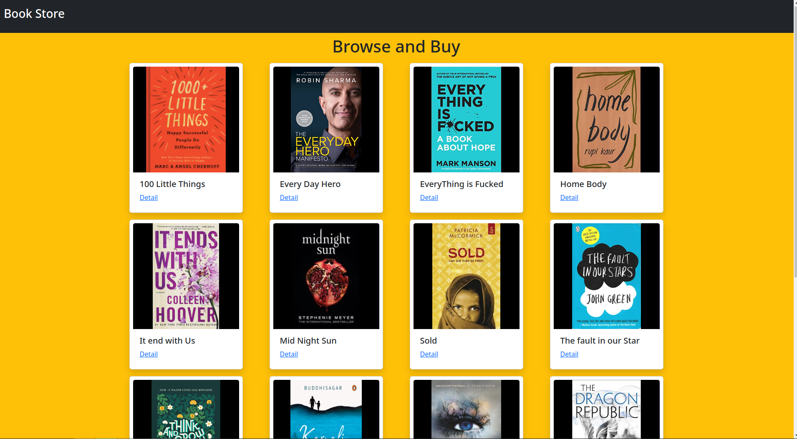
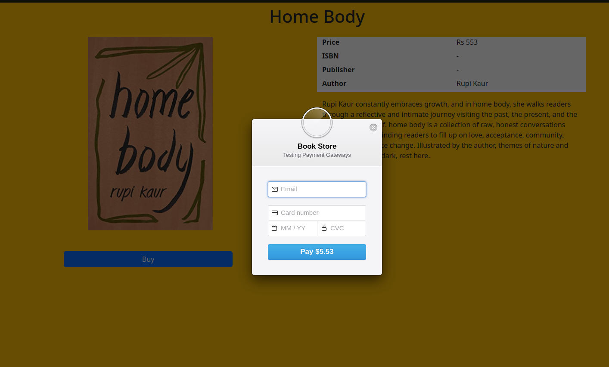

# Book Store 
Implementing Stripe Payment Gateway with express and nodejs.

## Packages 
* express: Web Server
* stripe: Payment Gateway
* express-handlebars: Template Engine
* bootstrap cdn: 

## Dev packages
* nodemon

## Installation Guide
**Prerequisite**
* Nodejs
* Stripe account and (API Keys)[https://stripe.com/docs/keys]

```bash
# copy the content of the .env.example and add you stripe keys

# Install packages
yarn
# run dev server
yarn dev:server
```

## API Routes
| Api | Description |
|------|------------|
| /api/books | Get List of books |
| /api/books/:id | Get Book Detail |


## Screen Shots



