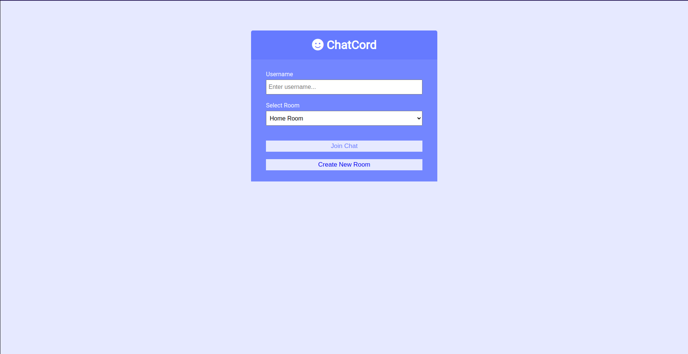
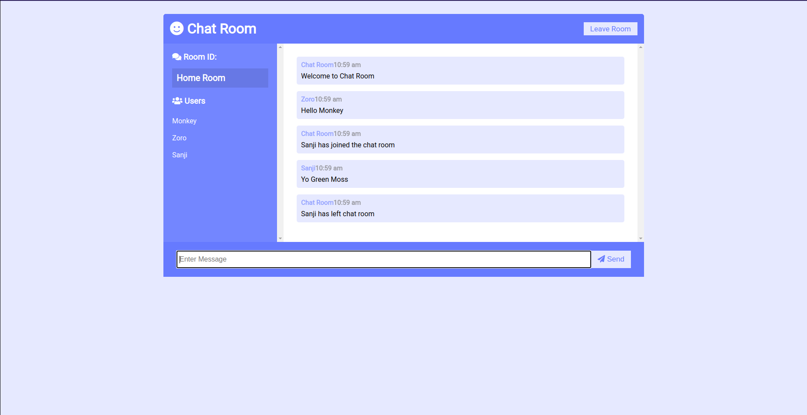
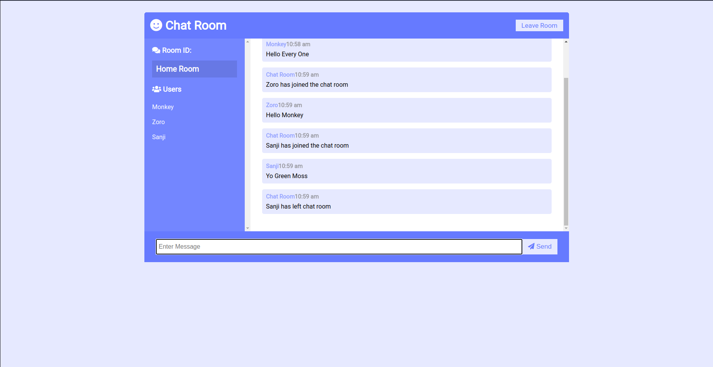
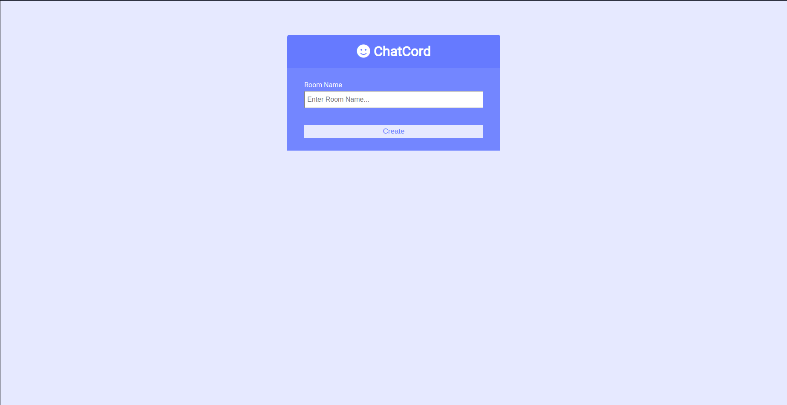

# Chat Room

A real time chat app where user can join different rooms and have conversation.  
Source [youtube/traversymedia](https://www.youtube.com/watch?v=jD7FnbI76Hg)

## Packages used
1. express: Web server
1. Socket.io: Sending and receiving data with socket;
1. Moment: Date formatting.

## Installation guide

```bash
# Install packages
yarn
# run server dev mode
yarn dev:server
```

## Screen shots



