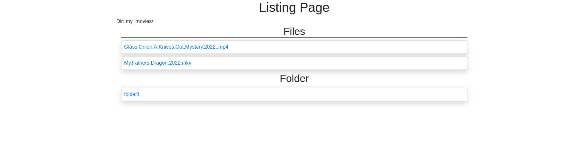
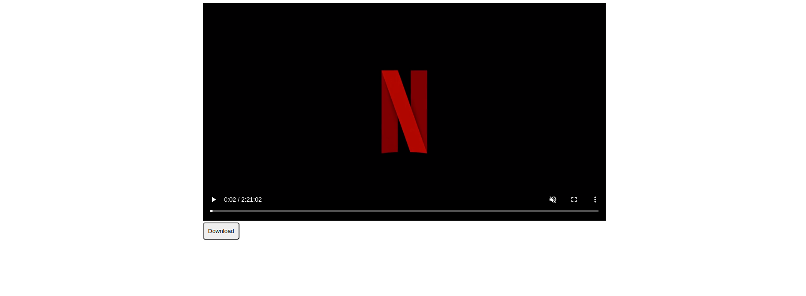

# Video Server

Video Streaming Application using HTTP streaming.

## Packages used
1. Express
1. ejs (template engine)

## Installation guide
```bash
# install packages with your package manager
yarn
# set up .env ( The dot env should contain the folder that should be display in the listing page). See .env.example
# run server
yarn dev:server
```

## ScreenShot

